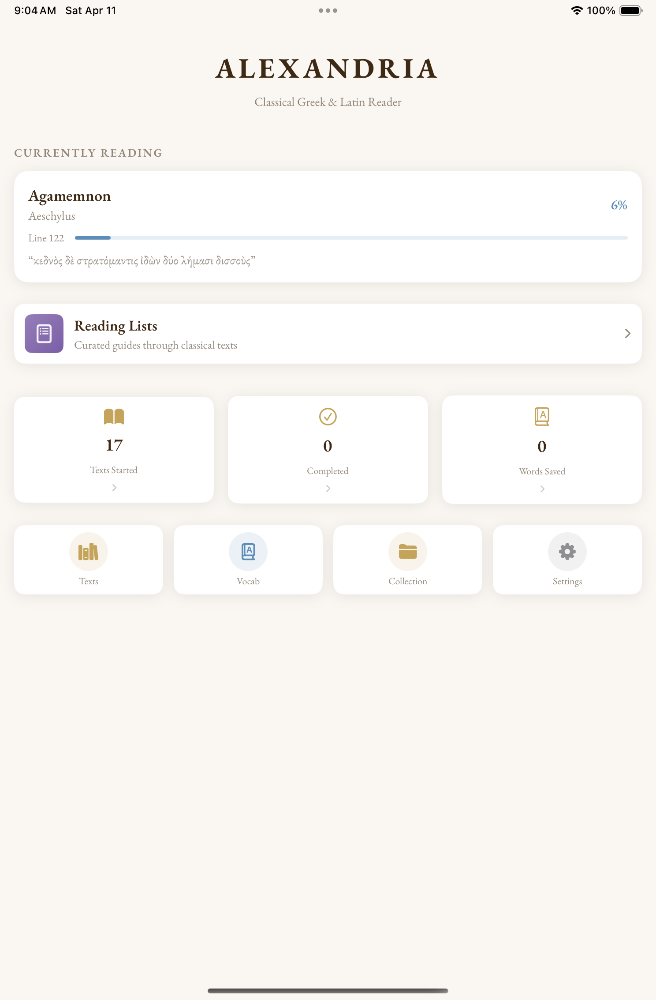
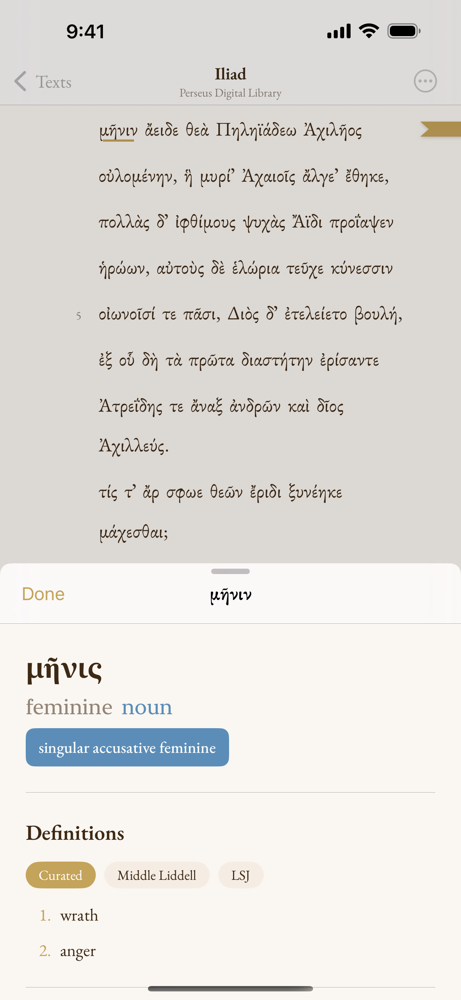
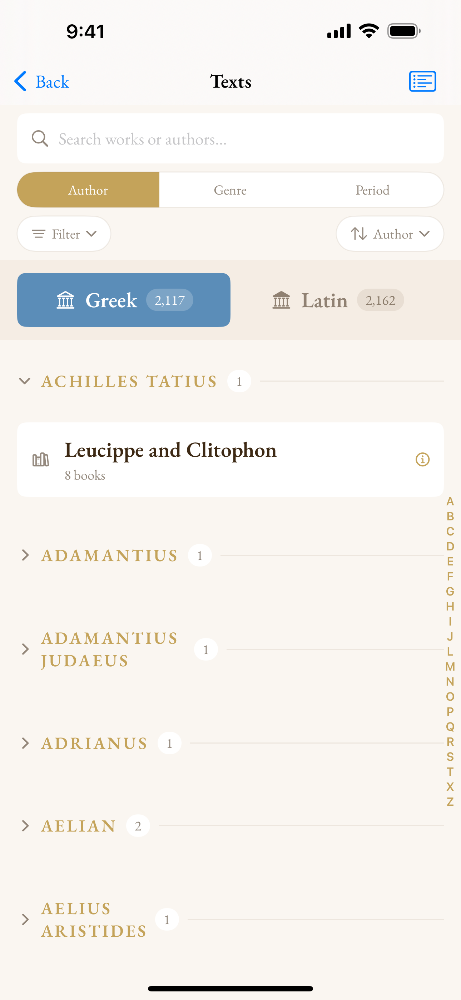
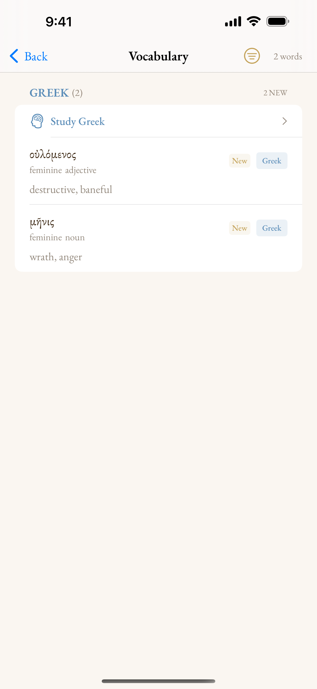

## Read Greek and Latin

Alexandria is a Greek and Latin reader for iPhone and iPad. Tap any word to see its dictionary entry, its morphological parse, and its grammatical features. All of it runs on the device, with no internet connection.

The library holds more than 4,200 texts by over 500 authors, split about evenly between Greek and Latin, drawn from the Perseus and CLTK corpora. The same reading tools work everywhere, whether it's your first page of Homer or your tenth pass through Thucydides.

::: {layout-ncol=2}
{fig-alt="Alexandria home screen with a currently-reading card for Homer's Iliad, a daily reading streak, and curated reading lists"}

{fig-alt="Alexandria reader with a tapped Greek word showing its morphological parse and a dictionary entry, with a Middle Liddell / LSJ dictionary picker"}

{fig-alt="Alexandria library showing the Greek and Latin tabs with text counts and an author list with per-work counts"}

{fig-alt="Alexandria's saved vocabulary list showing Greek words with their parses and glosses, with a Study button to begin spaced-repetition review"}
:::

## Features

### A Classical Library

The texts come from the Perseus and CLTK corpora: epic, lyric, drama, oratory, history, philosophy, and more. Browse by author, genre, or period, and switch between Greek and Latin with a tap. Each author has a short biography with their dates and major works. When a work survives in more than one edition, you can compare them, and 40 curated reading lists suggest where to start.

The library runs from the earliest Greek literature through the late Latin authors:

- **Greek**: Homer, Hesiod, Pindar, Aeschylus, Sophocles, Euripides, Aristophanes, Herodotus, Thucydides, Xenophon, Plato, Aristotle, Demosthenes, Lysias, Plutarch, Lucian, and many more
- **Latin**: Cicero, Virgil, Ovid, Horace, Catullus, Sallust, Livy, Tacitus, Seneca, Apuleius, Caesar, Pliny, and many more

### Morphological Analysis

Tap a word and Alexandria parses it: lemma, part of speech, case, number, gender, tense, mood, voice. The engine knows more than 270,000 stems and handles irregular forms, compound verbs, contractions, and dialect. It works for every text, offline, with nothing to download.

### Choose Your Dictionary

One gloss often isn't enough. Alexandria ships several dictionaries and lets you switch between them for any word, right in the lookup:

- **Latin**: Lewis & Short, Elementary Lewis, and Whitaker's Words
- **Greek**: the full Liddell-Scott-Jones (LSJ) and the Middle Liddell
- **Both languages**: DCC Core Vocabulary, frequency-ranked glosses for the most common words

Start with a short gloss while you read, then open the full entry when you want every sense.

### Vocabulary & Study

- **Spaced-repetition flashcards.** Save words as you read and review them on an SRS schedule, as multiple-choice, typed-answer, or classic cards.
- **Streaks and achievements.** Small nudges to keep the habit going.
- **Reading statistics.** Texts started, texts finished, words saved.

### Built for Long Reading Sessions

- **Adjustable font size.** Set the text size with a slider.
- **Dynamic Type.** UI text scales with your system accessibility settings.
- **Reading progress.** The app remembers where you stopped in every text.
- **Bookmarks and saved passages.** Keep the lines you want to return to.
- **Dark mode.** Comfortable reading in low light.
- **Accessibility.** Full VoiceOver support, Reduce Motion, and a Differentiate-Without-Color mode that adds non-color cues to grammatical information.

### Offline & Private

Everything stays on your device. The engine, the dictionaries, and the full text library are bundled in the app. No server calls, no accounts, no tracking. If you use iCloud, your reading progress and saved words sync across your devices through your own private iCloud container.

See the full [privacy policy](privacy.qmd).

## What Alexandria Is Not

Alexandria is a reader, not an editor, translator, or critical apparatus. A few things it deliberately leaves out:

- **Not a translation tool.** It gives you morphological analysis and short glosses to support reading in the original. It does not produce full English translations.
- **Not a critical edition.** The texts come from open digital corpora, mainly Perseus and CLTK. These are reliable standard editions, but there is no critical apparatus, no variant readings, and no textual notes.
- **Not a grammar reference.** The lookup parses a specific form. It does not teach paradigms or syntax. It works alongside a grammar, not in place of one.
- **Not a corpus search tool.** You can browse and read, but there is no cross-text search, concordance, or text analysis.
- **Not a social platform.** No accounts, no shared annotations, no community features. It is a private reading tool.

## Get Alexandria

Alexandria is in beta on TestFlight. Request access below and you'll get an Apple TestFlight invitation by email once you're approved, with everything you need to install it.

<form id="beta-form" class="beta-form" action="https://api.web3forms.com/submit" method="POST">
  <input type="hidden" name="access_key" value="12c4d056-de64-4f16-be69-c47cf24c5692">
  <input type="hidden" name="subject" value="New Alexandria beta request">
  <input type="hidden" name="from_name" value="Alexandria Beta Signup">
  <input type="hidden" name="redirect" value="https://jtylerkirby.com/alexandria/">
  <input type="checkbox" name="botcheck" style="display:none !important" tabindex="-1" autocomplete="off">

  <label class="beta-label" for="beta-name">Name</label>
  <input class="beta-input" id="beta-name" type="text" name="name" required autocomplete="name">

  <label class="beta-label" for="beta-email">Email</label>
  <input class="beta-input" id="beta-email" type="email" name="email" required autocomplete="email">

  <label class="beta-label" for="beta-institution">Institution (optional)</label>
  <input class="beta-input" id="beta-institution" type="text" name="institution"
         placeholder="University, school, or independent" autocomplete="organization">

  <button class="beta-button" type="submit">Request Beta Access</button>
  
Your name and email are only used to send you a TestFlight invite. Nothing else.

</form>

✓ You're on the list. I'll send a TestFlight invite soon.

- [Privacy Policy](privacy.qmd)
- [Source & Issues](https://github.com/TylerKirby/alexandria/issues)
